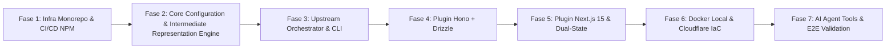

# NordixGen: Plan de Implementación y Evolución Técnica

> **Roadmap Estratégico y Fases de Desarrollo.**  
> Este documento rige la descomposición en epics, issues y entregables verificables para la construcción de **NordixGen**. Cada fase representa un incremento de valor concreto, probado y comprobable.

---

## 🗺️ Resumen Ejecutivo de Fases

---

## 📌 Detalle de Fases, Tareas e Hitos Verificables

### 🚀 Fase 1: Cimientos del Monorepo, Tooling y Pipeline de Publicación NPM
**Objetivo:** Configurar la infraestructura del proyecto open-source con pnpm workspaces, Node.js 24 LTS, TypeScript 5.8+, Biome y el workflow automatizado de publicación continua a npm al fusionar en `main`.

- [ ] **1.1 Configuración de Monorepo & Workspaces:**
  - Estructuración de `packages/core` y `packages/cli`.
  - Configuración base de `tsconfig.json` compartido (ESM, NodeNext).
  - Configuración de linter y formateador ultrarrápido con `@biomejs/biome`.
- [ ] **1.2 Pipeline de Publicación Automática a NPM en `main`:**
  - Configurar GitHub Actions workflow `.github/workflows/release.yml`.
  - Integrar Changesets o Semantic Release para versionado semántico automático.
  - Publicación con **npm Provenance (OIDC tokenless)** para seguridad de la cadena de suministro.
  - Validación de compatibilidad con Node.js 24 (`engines: { "node": ">=24.0.0" }`).
- [ ] **1.3 Workflow de Integración Continua (CI) en PRs:**
  - Validación obligatoria en Pull Requests hacia `develop`: `lint`, `typecheck`, `test`.

*Criterio de Aceptación / Hito Verificable:*
- `pnpm build`, `pnpm lint` y `pnpm test` se ejecutan sin errores en los workspaces vacíos.
- El workflow de CI está listo para validar ramas de features.

---

### 🧠 Fase 2: Motor `@nordixgen/core` (Esquemas Zod, Representación Intermedia y Sistema de Archivos Virtual)
**Objetivo:** Crear el cerebro del generador, responsable de parsear el YAML, validar la coherencia del negocio, calcular dependencias topológicas y escribir en un sistema de archivos virtual antes de tocar el disco.

- [x] **2.1 Esquema Zod Exhaustivo (`nordix.config.yaml`):**
  - Definición de tipos de campos: `string`, `number`, `boolean`, `date`, `uuid`, `json`, `enum`.
  - Modificadores: `required`, `unique`, `default`, `description`.
  - Relaciones: `many-to-one`, `one-to-many`, `one-to-one`, `many-to-many`.
  - Soft-delete (`softDelete`), timestamps y políticas de cascada (`onDelete`).
  - Timestamps independientes (`createdAt`, `updatedAt`) y `deletedAt` cuando se habilita soft-delete.
  - Propiedad explícita de cada entidad y endpoint por backend.
  - Topología de organizaciones/repositorios; cada frontend/backend asignado a un repositorio.
  - Definición de endpoints CRUD y endpoints complejos con `joins`.
  - Múltiples conexiones frontend-backend (`connectsTo`); las conexiones vacías y backends sin consumidores son válidos.
  - Configuración de State Management (`client: zustand`, `server: tanstack-query`).
- [x] **2.2 Generador de JSON Schema:**
  - Script para emitir `nordix.schema.json` para auto-completado y validación en VSCode / IDEs con `# yaml-language-server`.
- [x] **2.3 Resolvedor del Grafo Semántico (Nordix Intermediate Representation):**
  - Normalización de datos sin ambigüedades.
  - Algoritmo de Kahn (ordenamiento topológico de entidades según dependencias de Foreign Keys) para migraciones y seeders sin deadlocks.
- [x] **2.4 Matriz de Validación de Compatibilidades:**
  - Detección de incompatibilidades declarativas y emisión de errores amigables antes de generar nada.
- [x] **2.5 Virtual File System Determinista:**
  - Sistema de árbol de archivos en memoria con operaciones idempotentes, orden de claves determinista y formateo automático.

*Criterio de Aceptación / Hito Verificable:*
- Tests unitarios con Vitest con 100% de cobertura de líneas, funciones, sentencias y ramas; incluye ciclos circulares, tipos inexistentes, errores de sintaxis y el ejemplo `examples/ecommerce.yaml`.

---

### 💻 Fase 3: Upstream Scaffolding Orchestrator & CLI `@nordixgen/cli`
**Objetivo:** Desarrollar el binario ejecutable `npx nordixgen` y la orquestación segura de generadores oficiales upstream.

- [ ] **3.1 Comandos del CLI con Commander & `@clack/prompts`:**
  - `nordixgen --version`: Valida versión de Node anfitriona (>=24) y versión de CLI.
  - `nordixgen validate -f <file.yaml>`: Valida la sintaxis y semántica sin escribir nada.
  - `nordixgen init`: Asistente interactivo en terminal para crear un `nordix.config.yaml` inicial.
  - `nordixgen generate -f <file.yaml> -o <targetDir>`: Orquestación completa de generación.
- [ ] **3.2 Upstream Scaffolder:**
  - Invocación no-interactiva de `create-next-app` o desempaquetado de plantilla canónica curada.
  - Invocación de templates base Cloudflare Workers (`npm create cloudflare`).
  - Ensamblaje del Monorepo con `pnpm-workspace.yaml` raíz y scripts `pnpm dev`.
  - **Preflight de repositorios remotos:** antes de generar archivos o crear remotos, comprobar la autenticación activa de GitHub CLI, verificar que la cuenta personal coincide con el handle configurado o que puede crear repositorios en la organización, y confirmar que el nombre remoto no esté ocupado.
  - Para repositorios inicializados, comprobar que Git tiene una identidad configurada; después de crear el remoto, verificar el URL y ejecutar `git push --dry-run` antes del primer push real. La autorización de push depende de reglas del repositorio nuevo y no puede comprobarse por completo antes de crearlo.
  - Si faltan credenciales o permisos, detenerse con instrucciones para corregir `gh auth login`, cambiar la cuenta activa o pedir acceso. Nunca guardar ni imprimir tokens. El primer adaptador remoto implementado es GitHub; GitLab y Bitbucket quedan pendientes.

*Criterio de Aceptación / Hito Verificable:*
- Al ejecutar `nordixgen validate examples/ecommerce.yaml` el CLI valida y muestra un resumen con spinner de Clack sin errores.
- El generador crea scaffolds upstream de Next.js 15 y Hono y ensambla los repositorios/workspaces definidos en `repositories`; Git init y creación remota son opt-in.
- Para `createRemote: true`, comprobar identidad y permiso de creación antes de la generación; comprobar URL e intentar `git push --dry-run` antes del primer push. El permiso de push no puede confirmarse por completo antes de crear un repositorio nuevo, porque depende de sus reglas.

---

### 🛡️ Fase 4: Plugin Hono + Drizzle ORM (Golden Path Backend)
**Objetivo:** Inyectar una Clean Architecture empresarial en Cloudflare Workers sobre el scaffolding base de Hono.

- [ ] **4.1 Capa de Dominio (Domain Layer):**
  - Entidades puras en TypeScript (`src/domain/entities/<entity>.ts`).
  - Interfaces de repositorios (Ports) libres de dependencias de frameworks.
- [ ] **4.2 Capa de Aplicación (Application / Use Cases):**
  - Casos de uso atómicos (`Create<Entity>UseCase`, `List<Entity>UseCase`, `GetSummaryUseCase`).
  - DTOs tipados validados con Zod.
- [ ] **4.3 Capa de Infraestructura (Infrastructure Layer - Drizzle + Neon):**
  - Esquemas Drizzle (`src/infrastructure/db/schema/<entity>.ts`) con `pgEnum`, índices y relaciones.
  - Repositorios Drizzle (Adapters) implementando los puertos del dominio.
  - Manejo de transacciones, soft delete transparente y joins relacionales (`db.query.*`).
  - Migraciones Drizzle Kit automáticas (`drizzle-kit generate / migrate`).
- [ ] **4.4 Capa Web y Presentación (Hono Controllers & Middlewares):**
  - Enrutador modular con validación `@hono/zod-validator`.
  - Manejador de errores RFC 7807 Problem Details (`application/problem+json`).
  - Módulo de Autenticación nativo Cloudflare (Web Crypto PBKDF2/SHA-256, JWT, Refresh Tokens).
  - Middlewares de autorización RBAC (`requireRole`) y PBAC (`requirePermission`).
- [ ] **4.5 Seeders Sintéticos con `@faker-js/faker`:**
  - Script autoejecutable (`pnpm db:seed`) que respeta el orden topológico.

*Criterio de Aceptación / Hito Verificable:*
- Backend generado compila con TypeScript y corre en local con `wrangler dev` respondiendo a los endpoints CRUD y auth.

---

### 🎨 Fase 5: Plugin Next.js 15 & Dual-State Management (Golden Path Frontend)
**Objetivo:** Generar interfaces reactivas con App Router, Tailwind CSS v4, Feature-Driven Architecture y el modelo de Estado Dual.

- [ ] **5.1 Configuración Base del Frontend:**
  - Tailwind CSS v4 con variables CSS y tema personalizable (`@theme`).
  - Componentes de UI atómicos accesibles (Botones, Inputs, Modales, Tablas, Badges, Toasts).
- [ ] **5.2 SDK Cliente API Tipado End-to-End (`@/services/<entity>.service.ts`):**
  - Wrapper tipado sobre Fetch nativo con interceptor para RFC 7807.
  - Métodos CRUD y endpoints complejos vinculados a cada backend en `connectsTo`.
- [ ] **5.3 Capa de Servidor React Query (`@/hooks/queries/`):**
  - Hooks reactivos de consulta (`use<Entity>Query`) con caching inteligente.
  - Mutaciones (`useCreate<Entity>Mutation`) con invalidación automática de consultas de lista.
  - Soporte de Mutaciones Optimistas configurables.
  - Los esquemas/consultas disponibles en cada frontend se derivan de las entidades de sus backends conectados; server-state mantiene cache e invalidación para evitar refetches repetidos.
- [ ] **5.4 Capa de Cliente Zustand (`@/stores/`):**
  - `authStore`: Almacenamiento seguro de tokens, sesión activa y verificación de permisos.
  - `uiStore`: Toasts, alertas y estado de interfaz.
- [ ] **5.5 Vistas Completas Feature-Driven por Entidad:**
  - Lista paginada con filtros y búsqueda.
  - Formularios de creación y edición con validación React Hook Form + Zod.
  - Modales de confirmación de eliminación (Soft Delete / Hard Delete).

*Criterio de Aceptación / Hito Verificable:*
- El frontend generado compila con `pnpm build`, se comunica con el backend Hono, y gestiona el estado sin errores de hidratación ni re-renders innecesarios.

---

### 🐳 Fase 6: Entorno Docker Local & Cloudflare Native CI/CD + IaC
**Objetivo:** Asegurar desarrollo local sin fricción y despliegue a producción en un clic.

- [ ] **6.1 Docker Compose Local (`docker-compose.yml`):**
  - PostgreSQL 16 Alpine con healthcheck.
  - Mailpit para captura y visualización de emails transaccionales.
  - MinIO para almacenamiento compatible con S3 / Cloudflare R2.
  - Redis 7 para colas y caché.
- [ ] **6.2 CI/CD Nativo en Cloudflare:**
  - Configuración de `wrangler.toml` por backend y directivas de Cloudflare Pages por frontend.
  - Script unificado de build con migraciones previas (`pnpm db:migrate && pnpm build`).
- [ ] **6.3 Infraestructura como Código (Terraform / OpenTofu):**
  - Módulos en `infra/terraform/` para provisionar: Cloudflare R2, Hyperdrive, Pages, Workers y DNS.

*Criterio de Aceptación / Hito Verificable:*
- `pnpm docker:up` levanta todos los servicios locales de inmediato y `terraform validate` es exitoso.

---

### 🤖 Fase 7: AI Agentic Tooling & Validación End-to-End (E2E)
**Objetivo:** Exponer la lógica de negocio para agentes de IA y validar el ciclo de vida completo de un proyecto de gran escala.

- [ ] **7.1 Endpoint de Herramientas para Agentes Inteligentes:**
  - `GET /api/agent/tools`: Catálogo JSON Schema de todos los casos de uso.
  - `POST /api/agent/execute`: Ejecución segura validada por Zod y auditada.
- [ ] **7.2 Suite de Pruebas E2E Automatizadas:**
  - Generación de un proyecto SaaS E-commerce completo a partir del archivo YAML más avanzado.
  - Verificación de compilación TypeScript en todos los frontends y backends generados.
  - Verificación de ejecución de tests unitarios del proyecto generado.

---

### 🌐 Fase 8: Revisión y Transición Total del Repositorio a Inglés (Open Source Readiness)
**Objetivo:** Asegurar que todo el código fuente, la documentación técnica y las salidas del CLI estén 100% en inglés estándar para la distribución global en npm y la comunidad open source.

- [ ] **8.1 Traducción Integral de Documentación Markdown:**
  - `README.md`
  - `docs/SPECIFICATION.md`
  - `docs/IMPLEMENTATION_PLAN.md`
  - `packages/README.md`
- [ ] **8.2 Auditoría de Código y Salidas:**
  - Nombres de interfaces, clases, funciones y variables en inglés.
  - Comentarios, docstrings y JSDocs en inglés.
  - Textos de ayuda y errores en la interfaz del CLI en inglés.
  - Mensajes de commits y changelogs en formato Conventional Commits en inglés.

---

## 📋 Mapeo con el Backlog de GitHub (Epic #39 en NordixCompass / NordixCore)

| Fase | Sub-Issue en GitHub | Size | Iteración |
| :--- | :--- | :--- | :--- |
| **Fase 1** | [#44: Phase 1: Monorepo Foundations, Tooling & NPM Continuous Release](https://github.com/NordixTech/NordixCore/issues/44) | M | Month-01 |
| **Fase 2** | [#45: Phase 2: Core Engine (@nordixgen/core) - Zod Schemas, IR Graph & Deterministic VFS](https://github.com/NordixTech/NordixCore/issues/45) | L | Month-01 |
| **Fase 3** | [#46: Phase 3: Upstream Scaffolding Orchestrator & CLI (@nordixgen/cli)](https://github.com/NordixTech/NordixCore/issues/46) | M | Month-01 |
| **Fase 4** | [#48: Phase 4: Plugin Hono + Drizzle ORM (Golden Path Backend)](https://github.com/NordixTech/NordixCore/issues/48) | XL | Month-01 |
| **Fase 5** | [#49: Phase 5: Plugin Next.js 15 & Dual-State Management (Golden Path Frontend)](https://github.com/NordixTech/NordixCore/issues/49) | XL | Month-01 |
| **Fase 6** | [#51: Phase 6: Local Docker Environment & Cloudflare Native CI/CD + IaC](https://github.com/NordixTech/NordixCore/issues/51) | L | Month-01 |
| **Fase 7** | [#52: Phase 7: AI Agentic Tooling & End-to-End Validation](https://github.com/NordixTech/NordixCore/issues/52) | M | Month-01 |
| **Fase 8** | [#54: Phase 8: Comprehensive English Localization & Documentation Review](https://github.com/NordixTech/NordixCore/issues/54) | S | Month-01 |
