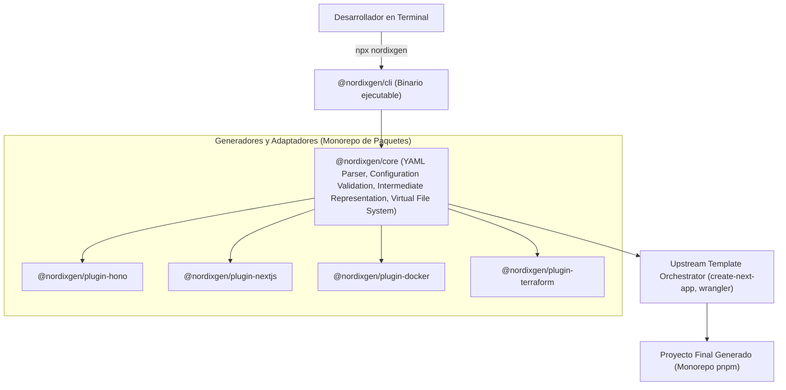
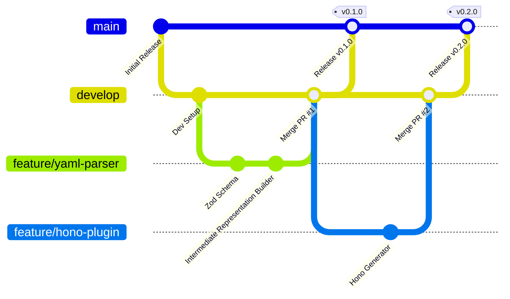
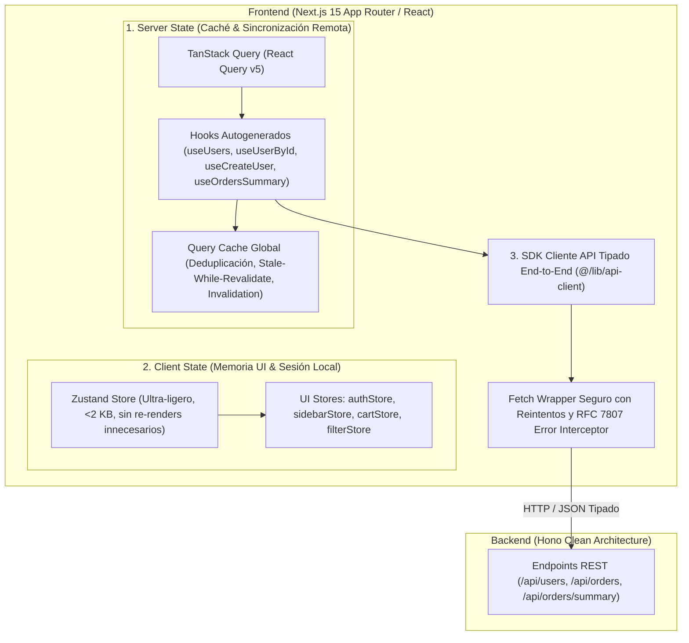
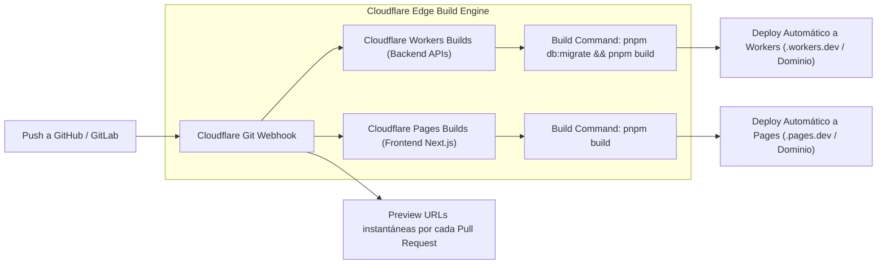
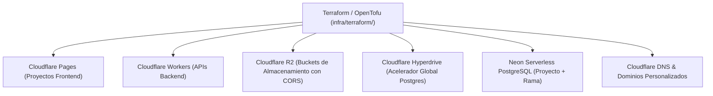

# NordixGen: Especificación Integral de Requisitos, Arquitectura y Capacidades

> **Documento de Consolidación de Requisitos y Capacidades del Sistema**  
> **Estado:** Documento de especificación oficial versionado en el repositorio.
> **Alcance Inicial:** Foco exclusivo en el **Golden Path** (Next.js + Tailwind CSS v4 + Hono + Drizzle ORM + Neon PostgreSQL + Cloudflare), con arquitectura modular extensible a múltiples frontends/backends y despliegues con IaC.

---

## 🎯 1. Filosofía y Principios Rectores

1. **Generación 100% Algorítmica y Determinista:**
   - El motor generador **no utiliza LLMs para escribir código**. No hay alucinaciones de sintaxis ni variabilidad entre ejecuciones.
   - Si el archivo YAML no cambia, el proyecto generado es exactamente idéntico.
2. **Rol de la Inteligencia Artificial (Capa Externa / Skill):**
   - La IA interviene únicamente antes de la generación mediante una **Skill de Asistencia**.
   - Guía al desarrollador en lenguaje natural para modelar su negocio y producir un archivo `nordix.config.yaml` válido, estructurado y optimizado.
3. **El Golden Path (Ruta Dorada Oficial):**
   - Aunque la plataforma admite definir múltiples aplicaciones y frameworks, el esfuerzo de ingeniería inicial se concentra en una combinación insignia de máximo rendimiento y coste de nube $0 / ultrabajo:
     - **Frontend:** Next.js 15 (App Router) + Tailwind CSS v4 + Feature-Driven Architecture.
     - **Backend:** Hono (TypeScript) + Clean Architecture (Ports & Adapters) + Cloudflare Workers.
     - **Persistencia & ORM:** PostgreSQL en Neon (Serverless) + Drizzle ORM (<30 KB bundle).
     - **Despliegue & Edge:** Cloudflare Pages + Workers + R2 (Almacenamiento compatible S3, $0 egress).
     - **CI/CD:** **Nativo de Cloudflare (Cloudflare Workers Builds & Pages Git Integration)**: Cero configuración de secretos externos, builds automáticos en el edge, preview deployments por PR y rollbacks instantáneos.
     - **Aceleración de Base de Datos:** Cloudflare Hyperdrive para pooling y caché global de PostgreSQL.
     - **Desarrollo Local:** Docker Compose (PostgreSQL 16, Mailpit, MinIO, Redis).

---

## 📦 2. Modelo de Distribución Open Source y Paquetes NPX / NPM

NordixGen se diseña y publica como un ecosistema open-source modular en el registro público de `npm`:



### Formas de Consumo:
1. **Ejecución Instantánea sin Instalación (Recomendada):**
   ```bash
   npx nordixgen init
   npx nordixgen generate -f nordix.config.yaml -o ./mi-proyecto
   ```
2. **Instalación Global:**
   ```bash
   npm install -g nordixgen
   nordixgen generate -f nordix.config.yaml
   ```

### Arquitectura de Paquetes en el Monorepo del CLI:
- **`nordixgen` / `@nordixgen/cli`:** Interfaz de línea de comandos, comandos interactivos (`init`, `generate`, `validate`), spinners y formateo de terminal con `@clack/prompts`.
- **`@nordixgen/core`:** Motor de esquemas Zod, validador YAML, constructor de la representación intermedia, sistema de archivos virtual, ordenamiento topológico y matriz de incompatibilidad.
- **Plugins Especializados:** Los plugins de arquitectura, framework y persistencia implementan contratos separados sobre la representación intermedia. Esto permite agregar, por ejemplo, una arquitectura Hexagonal, un framework `.NET` o un ORM adicional sin convertir el núcleo en un generador monolítico.

### Modular Backend Generation Contract

NordixGen builds each backend as a validated composition of plugins with independent responsibilities. **Plugin** is the selectable extension unit; **generation engine** is the core coordinator that discovers, validates, and executes plugins. A plugin may contain internal modules, but “module” is not the public extension contract.

#### Responsibilities

- **Core/composer:** consumes the intermediate representation (IR), resolves plugins, validates requirements and capabilities, prepares the generation context, and coordinates contributions to the virtual file system (VFS). It must report errors before emitting files.
- **Architecture plugin:** defines layers, boundaries, and semantic locations for entities, use cases, ports, adapters, controllers, and configuration. Clean, Hexagonal, and Onion are distinct selectable strategies. Architecture plugins do not emit Hono-, C#-, or other framework-specific syntax.
- **Framework plugin:** defines the language, upstream scaffold, code root within the application, import conventions, entry points, and namespace rules where applicable. It receives the architecture layout and emits framework-specific syntax. For example, the .NET plugin derives namespaces from final paths while Hono generates TypeScript modules.
- **ORM/persistence plugin:** implements concrete persistence (schemas, mappings, repositories, queries, and migrations) and declares compatible languages, database engines, and runtimes. Its files go in the infrastructure locations provided by the architecture strategy.
- **Database resource:** describes the storage engine and provider, not the ORM. Multiple backends may reference the same resource when configured to do so.

#### Framework and architecture handshake

The dependency is coordinated through a shared context instead of plugins importing one another:

1. The framework provides `BackendProjectContext`: language, application root, code root (for example `src`), file conventions, import/namespace rules, and runtime constraints.
2. The architecture plugin receives that context and the backend IR, then returns an `ArchitectureLayout`: paths for semantic roles (entity, use case, port, adapter, controller, and so on) and dependency rules between layers.
3. Framework and ORM plugins consume the resolved context and layout to emit files at the correct locations. The framework plugin is responsible for imports and namespaces that match the final paths.
4. The composer detects path and dependency conflicts before writing to disk.

The backend path in YAML defines the application root; the framework defines the code root and project-specific conventions; architecture resolves its layout beneath that root. This prevents generated business files from leaking into the repository root and lets one Clean strategy work with Hono’s `src/` layout or .NET projects, directories, and namespaces.

#### Extensible compatibility

The registry must not manually enumerate every possible combination; that would grow as a Cartesian product of architectures, frameworks, and ORMs. Each plugin declares a stable identifier/version, provided capabilities, and requirements/constraints. The resolver checks the selected set before generation:

- Unknown or unavailable plugin: actionable error, such as “no ORM plugin is registered for `orm: prisma`.”
- Known but incompatible combination: error identifies the unmet requirement, such as Entity Framework requiring C# and not matching Hono’s TypeScript context.
- Explicitly requested but unsupported capability: blocking error before generation. Warnings are reserved for non-blocking recommendations.
- Valid combination: deterministic VFS generation and validation of paths, imports, and dependencies.

Third parties must be able to register plugins through the public contract without changing core. The first implementation does not need dozens of plugins: it must validate the contract with Clean, Hono/TypeScript, and Drizzle/PostgreSQL, and prove that an incompatible combination is rejected before generation.

#### ORM and database YAML model

Database configuration uses named resources. The ORM belongs to each backend’s persistence configuration because the backend determines its language/runtime and ORM compatibility. There must not be a single global ORM:

```yaml
databases:
  commerce-db:
    engine: postgres
    provider: neon

backends:
  - name: core-api
    framework: hono
    architecture: clean
    persistence:
      database: commerce-db
      orm: drizzle

  - name: inventory-api
    framework: dotnet
    architecture: hexagonal
    persistence:
      database: commerce-db
      orm: entity-framework
```

`persistence` is optional for backends that do not use storage. Semantic validation checks that each database reference exists and that the ORM plugin supports the selected framework/runtime and database engine. Secrets and connection strings are not stored in YAML; they are configured in the generated environment.

### Estrategia de Scaffolding Upstream

NordixGen utiliza los generadores oficiales de los frameworks para producir sus estructuras iniciales, en lugar de mantener una copia privada de cada plantilla. El CLI orquesta `create-next-app` para Next.js y el template oficial `cloudflare-workers` de `create-hono` para Hono con versiones fijadas y opciones no interactivas. El scaffold de Hono instala dependencias, pero no inicializa Git ni despliega a una cuenta cloud. Después, NordixGen integra las aplicaciones en los repositorios/workspaces definidos por la configuración y añade una presentación inicial de marca en el README y la portada frontend.

Este límite es intencional: la herramienta upstream conserva las convenciones y archivos propios del framework; NordixGen aplica sus personalizaciones en puntos concretos y en fases posteriores genera la arquitectura de dominio, entidades, endpoints y estado de frontend declarados en YAML.
### Estrategia de Ramas Git y Pipeline de Publicación Automática a NPM:
Para el desarrollo propio de NordixGen como herramienta CLI open-source, se establece el siguiente flujo de trabajo estricto de Git:



1. **Ramas Principales:**
   - **`main` (Producción & Distribución):** Representa el código estable liberado al mundo. **Cada commit o pull request mergeado a `main` dispara automáticamente el pipeline de release continuo a NPM**.
   - **`develop` (Integración Continua):** Rama central donde convergen todas las características probadas. Los desarrolladores integran aquí sus cambios mediante Pull Requests antes de preparar una liberación a `main`.
   - **`feature/<nombre-feature>` (Trabajo Aislado):** Ramas cortas creadas desde `develop` para desarrollar una capacidad específica (ej. `feature/parser-yaml`, `feature/hono-generator`, `feature/cloudflare-iac`). Una vez completada y testeada, se abre un PR hacia `develop`.
   - **`hotfix/<nombre-fix>` (Parche Crítico):** Se ramifica directamente de `main` en caso de bug crítico en producción y se mergea de vuelta tanto a `main` (disparando release) como a `develop`.

2. **Pipeline Automatizado de Publicación en `main`:**
   - Al detectar un push en `main`:
     - Valida la suite completa de pruebas (`test:unit`, `test:integration`, `lint`, `typecheck`) bajo la versión de **Node.js Active LTS (Node 24)**.
     - Determina la nueva versión mediante **Semantic Release / Changesets** analizando los commits convencionales (`feat:`, `fix:`, `chore:`).
     - Compila los paquetes (`pnpm build`).
     - Publica automáticamente los paquetes actualizados (`@nordixgen/cli`, `@nordixgen/core`, etc.) al registro oficial de `npm` con **Provenance OIDC** y etiqueta `@latest`.
     - Genera automáticamente el Git Tag y la GitHub Release con su Changelog detallado.
   - De este modo, cualquier usuario en cualquier parte del mundo ejecuta inmediatamente `npx nordixgen@latest` y recibe la versión recién publicada.

3. **Requisitos de Runtime y Compatibilidad con Node.js:**
   - **Node.js Runtime Oficial:** Node.js **v24 (Active LTS)**.
   - Todo paquete publicado en el ecosistema NordixGen declara en su `package.json`:
     ```json
     "engines": {
       "node": ">=24.0.0"
     }
     ```
   - Al ejecutar `npx nordixgen`, el CLI valida activamente la versión de Node del usuario anfitrión (`process.version`). Si detecta una versión inferior a v24, muestra una alerta explicativa y guía al usuario para actualizar con su gestor de versiones preferido (`fnm` / `nvm`).
   - Los desarrolladores del proyecto gestionan sus versiones fácilmente con **`fnm` (Fast Node Manager)**:
     - `fnm install 24`: Instala Node 24.
     - `fnm default 24`: Fija Node 24 como la versión predeterminada del sistema.
     - `fnm use 24`: Cambia al instante de versión.
     - Archivo `.node-version` / `.nvmrc` en la raíz del repositorio con contenido `24` para auto-switch instantáneo con `fnm env --use-on-cd`.

---

## 🧩 3. Soporte para Múltiples Frontends y Múltiples Backends

Un sistema de software moderno puede combinar **múltiples aplicaciones cliente y servicios backend** en un monorepo, repositorios separados o cualquier agrupación intermedia definida en `repositories`:

### Casos de Uso Multi-App:
- **E-commerce:** Frontend Web Tienda (`apps/web-store`), Panel de Administración Web (`apps/web-admin`), App Móvil (`apps/mobile-app`), Backend API Core (`apps/api-core`), Worker de Procesamiento Asíncrono de Pagos (`apps/worker-payments`).
- **SaaS B2B:** Portal de Clientes, Landing Page de Marketing, Microservicios de Auth y Facturación.

### Declaración en YAML:
Cada aplicación señala su repositorio. Este ejemplo agrupa las apps en un solo repositorio; la misma forma admite listas de repositorios separados:

El bloque de autenticación de este ejemplo ilustra la estructura objetivo de Phase 4.11; no forma parte del esquema que acepta actualmente el parser.

```yaml
# Múltiples Frontends
repositories:
  - name: commerce
    path: .
frontends:
  - name: store-web
    framework: nextjs
    type: web
    styling: tailwind
    stateManagement: zustand
    repository: commerce
    connectsTo: [core-api]
    path: apps/store-web
  - name: admin-portal
    framework: nextjs
    type: web
    styling: tailwind
    stateManagement: zustand
    repository: commerce
    connectsTo: [core-api]
    path: apps/admin-portal

# Múltiples Backends
backends:
  - name: core-api
    framework: hono
    architecture: clean
    repository: commerce
    path: apps/api-core
    persistence:
      database: commerce-db
      orm: drizzle
    authentication:
      plugin: better-auth
      methods: [email-password, username-password]
      identityProviders: [google, github]
    authorization:
      roles: [admin, customer]
  - name: notifications-worker
    framework: hono
    architecture: modular
    repository: commerce
    path: apps/worker-notifications

databases:
  commerce-db:
    engine: postgres
    provider: neon
```

### Orquestación en Monorepo:
- **Espacio de Trabajo pnpm (`pnpm-workspace.yaml`):** Agrupa `apps/*` y `packages/*`.
- **Scripts Paralelos en Root `package.json`:**
  - `pnpm dev`: Inicia todas las apps en paralelo con prefijos de consola coloreados.
  - `pnpm dev:store-web`, `pnpm dev:admin-portal`, `pnpm dev:core-api`.
- **Puertos Locales Asignados Automáticamente:**
  - Frontend 1: `http://localhost:3000`
  - Frontend 2: `http://localhost:3001`
  - Backend 1 (Hono Core): `http://localhost:8787`
  - Backend 2 (Worker Notificaciones): `http://localhost:8788`

---

## 🛠️ 4. Orquestación de Upstream Starter Templates & Version Tracking

NordixGen **no genera archivos de inicialización desde strings crudos** cuando la comunidad oficial del framework ofrece herramientas canónicas de scaffolding.

### Enfoque: Scaffolding Upstream Oficial + Inyección de Arquitectura
1. **Fase 1: Scaffolding Upstream:**
   - Para Next.js: NordixGen orquesta y parametriza `create-next-app` (o desempaqueta una plantilla canónica oficial curada) con flags estrictos:
     ```bash
     npx create-next-app@15.1.7 [app-name] --typescript --tailwind --app --no-src-dir --import-alias "@/*" --use-pnpm
     ```
   - Para Cloudflare / Hono: Utiliza el template oficial `cloudflare-workers` de `create-hono`.
2. **Fase 2: Inyección de Arquitectura y Dominio (El Valor Real de NordixGen):**
   - Una vez instanciado el esqueleto oficial en el sistema de archivos virtual, NordixGen inyecta de forma algorítmica y determinista:
     - La Clean Architecture (capas de dominio, aplicación, infraestructura).
     - Los modelos y esquemas relacionales de Drizzle ORM.
     - Los endpoints y controladores tipados con validación Zod.
     - Integration with a maintained authentication library/provider and generated application-level RBAC/PBAC policies; NordixGen does not implement cryptographic protocols from scratch.
     - El cliente de API tipado para el frontend.
     - Las vistas completas de tablas, filtros y modales por entidad.
3. **Matriz de Fijación y Seguimiento de Versiones (Version Matrix & Node.js Binding):**
   - **Enlace Estricto de Node.js:** Cada paquete generado por NordixGen y el propio CLI vinculan explícitamente en `package.json` su motor compatible (`engines: { "node": ">=24.0.0" }` o `>=26.0.0`).
   - **Líneas de Node.js Oficiales:**
     - **Node.js 26 (Current / Próximo LTS):** Versión de última generación con soporte para las APIs más recientes de ECMAScript y V8.
     - **Node.js 24 (Active LTS):** Línea recomendada para entornos de producción de máxima estabilidad empresarial.
   - **Archivo `.nvmrc` y `.node-version`:** Se generan automáticamente en la raíz del proyecto para asegurar que cualquier desarrollador o runner de CI use la versión exacta.
   - **Package Manager:** `pnpm >= 10.0.0` (con enforcement estricto vía `packageManager` en `package.json`).
   - **Frameworks Principales Fijados:**
     - Next.js: `^15.1.7` (React 19, App Router).
     - Tailwind CSS: `^4.0.0` (Lightning CSS, `@theme`).
     - Hono: `^4.7.0` (Edge native).
     - Drizzle ORM: `^0.39.0` + Drizzle Kit `^0.30.0`.
     - Neon Serverless Driver: `@neondatabase/serverless ^0.10.4`.

---

## 📋 5. Matriz Completa de Capacidades Especificables en el YAML

A continuación se detalla cada sección, campo y capacidad que puede declararse en la especificación central `nordix.config.yaml`.

### Topología de código: organizaciones, repositorios y aplicaciones

- `organizations` registra proveedores (`github`, `gitlab`, `bitbucket`) y el `handle` de cada organización o cuenta.
- `repositories` es la lista de repositorios previstos. `path` ubica el checkout en el directorio de salida. `initializeGit` activa `git init`; ambos switches `initializeGit` y `createRemote` son `false` por defecto.
- `organization` vincula el repo con una organización declarada. `createRemote: true` requiere esa asociación; `visibility` puede ser `private` o `public` y por defecto es `private`.
- Cada frontend y backend declara `repository` y su `path` relativo a ese repositorio. Así se pueden juntar todas las apps en un repo, separar cada app o crear cualquier agrupación intermedia. Un repo puede contener varias apps.
- Cada frontend puede declarar `connectsTo: [backend-a, backend-b]`. Se permite `connectsTo: []` y también backends sin frontends asociados.
- Cada entidad y endpoint declara `backend`. Relaciones y joins se limitan a entidades de ese backend; la validación informa si se intenta cruzar esa frontera.

Las opciones de inicialización remota son declarativas en la fase actual. Cuando el CLI las ejecute, deberá usar una sesión o credencial ya configurada para el proveedor; el YAML no debe almacenar tokens.

Antes de cualquier operación remota, el CLI debe hacer un **preflight de identidad y permisos**:

1. Confirmar que el usuario autenticado con el proveedor corresponde al `handle` configurado en `organizations` (admite una cuenta personal o una organización).
2. Confirmar que esa identidad puede crear repositorios en esa cuenta u organización y que tendrá permiso de escritura en el repositorio nuevo.
3. Si la autenticación no existe, la identidad no coincide o faltan permisos, detenerse antes de crear el repositorio. Antes del primer push, verificar también que el remoto configurado corresponde al repositorio esperado y que la identidad tiene permiso de escritura.
4. Mostrar instrucciones accionables para corregir el acceso sin exponer tokens ni otros secretos en la salida.

La verificación debe usar el mecanismo de autenticación soportado por el proveedor (por ejemplo, una sesión ya iniciada en su CLI oficial o un flujo seguro equivalente). No debe solicitar que se escriba un token en el YAML.

### A. Modelado de Datos y Entidades (`entities` & `enums`)

#### 1. Enums Globales (`enums`)
- Listas de valores reutilizables entre frontend y backend (ej. `OrderStatus: [PENDING, PAID, SHIPPED, CANCELLED]`).
- Mapeados a `pgEnum` en Drizzle y a tipos TypeScript estrictos.

#### 2. Campos de Entidad (`fields`)
- **Tipos de datos soportados:**
  - `string`: Cadenas con longitud configurable (`varchar` o `text`).
  - `number`: Números enteros o de coma flotante (`integer`, `doublePrecision`, `decimal`).
  - `boolean`: Valores verdadero/falso.
  - `date`: Fechas y timestamps con zona horaria (`timestamp with time zone`).
  - `uuid`: Identificadores únicos universales.
  - `json`: Estructuras flexibles (`jsonb`).
  - `enum`: Referencia a un enum definido globalmente.
- **Restricciones y Modificadores:**
  - `required`: Booleano (default: `true`).
  - `unique`: Booleano (default: `false`).
  - `default`: Valor por defecto literal.
  - `description`: Comentario para OpenAPI/Swagger.

#### 3. Llaves Primarias y Auditoría
- **Primary Key:** Inyección automática de `id: uuid().defaultRandom().primaryKey()`.
- **Timestamps:** configurables de forma independiente: `timestamps.createdAt` y `timestamps.updatedAt` inyectan sus campos respectivos. Ambos están desactivados por defecto.
- **Soft Delete:** `softDelete` admite `false` (valor predeterminado, no inyecta ningún campo), `boolean` (inyecta `isDeleted: boolean`, inicializado en `false`) o `timestamp` (inyecta `deletedAt: Date | null`). La estrategia define la representación del borrado lógico; el adaptador de persistencia debe aplicar el filtro correspondiente en sus consultas.
- **Políticas de Cascada (`onDelete`):** `cascade`, `set-null`, `restrict`, `no-action`.

#### 4. Relaciones entre Entidades (`relations`)
- Cardinalidades: `many-to-one`, `one-to-many`, `one-to-one`, `many-to-many` (tabla intermedia autogenerada).
- Ordenamiento topológico automático (Algoritmo de Kahn) para sembradores y migraciones.

---

### B. Sistema de API y Endpoints

1. **Endpoints CRUD Estándar:** 5 endpoints RESTful por entidad (`List` paginado, `GetById`, `Create`, `Update`, `Delete`).
2. **Endpoints Complejos con JOINs Declarativos:**
   - Proyecciones relacionales que cruzan entidades del mismo backend (`inner` o `left`).
   - Parámetros tipados: `queryParams`, `pathParams`, `requestBody` (DTOs de Zod).
   - Consultas emitidas mediante la Relational Query API de Drizzle (`db.query.*.findMany`).

---

### C. Authentication and Authorization

NordixGen treats authentication as a **composable generator plugin**, alongside architecture, framework, and ORM plugins. Better Auth is the selected first authentication plugin and the authentication Golden Path for Phase 4.11. Better Auth is a library integrated into a generated backend, not an external identity provider and not a separately deployed authentication microservice by default. The generated application owns its deployment; Better Auth supplies maintained authentication behavior.

The authentication plugin must coordinate with the other plugins through declared capabilities rather than hard-coded technology assumptions:

- The **framework plugin** provides the HTTP handler, middleware hooks, runtime requirements, and request context integration. For the first combination, this means Hono integration and explicit validation of runtime requirements such as Cloudflare Workers' `nodejs_compat` where needed.
- The **architecture plugin** provides semantic file roles and resolved paths for authentication configuration, adapters, and delivery-layer integration. The authentication plugin must not assume that a particular layer or folder name exists.
- The **ORM and database plugins** provide supported persistence adapters, schema ownership, and migration capabilities. For the first combination, Better Auth uses its Drizzle adapter and the backend's selected database. Authentication-owned tables and migrations must be integrated without silently overwriting or duplicating application schema.
- The **core composer and compatibility registry** verify these requirements before generation. A missing authentication plugin, unsupported framework/runtime/ORM/database combination, or requested capability that the selected plugin does not provide is a blocking diagnostic before files are written.

**Alcance del ejemplo:** la forma YAML siguiente es el diseño objetivo de Phase 4.11; no describe lo que acepta el parser actual. Phase 4.11 actualizará el esquema y la implementación.

```yaml
backends:
  - name: core-api
    framework: hono
    architecture: clean
    persistence:
      database: commerce-db
      orm: drizzle
    authentication:
      plugin: better-auth
      methods: [email-password, username-password]
      identityProviders: [google, github]
    authorization:
      roles: [admin, customer]
```

`authentication.plugin` selects NordixGen's authentication generator plugin. `methods` declares local sign-in methods; `identityProviders` lists optional external identity providers. Provider client IDs/secrets, the Better Auth secret, database credentials, and mail delivery credentials belong in environment variables or a secret manager, never in YAML. `authorization` declares application policy inputs and is separate from authentication; the former asks what an authenticated identity may do, the latter establishes the identity.

1. **Identity and sign-in:**
   - Better Auth owns account verification, credential checks, session creation/revocation, password reset, and any enabled MFA behavior; NordixGen must configure and integrate the library rather than reimplement its security protocols.
   - The initial Golden Path covers Better Auth email/password and username sign-in capabilities, subject to the library's supported configuration and generated schema. Optional external providers (for example Google or GitHub) are configured through Better Auth and require credentials at runtime. OAuth 2.0 alone is an authorization framework; OIDC adds the standardized identity layer.
   - A PIN is a distinct, low-entropy authentication method, not a short-password setting. It is not part of the initial Better Auth Golden Path unless Phase 4.11 verifies a supported and adequately protected integration. NordixGen must reject an unsupported PIN request rather than silently lower password requirements or generate a weak credential flow. Any later PIN profile requires explicit threat-model limits, strict rate limiting/lockout, constrained sessions and permissions, and recovery/revocation behavior.
   - If local passwords are enabled, use Better Auth's maintained password-storage implementation and validate its defaults and configuration against current OWASP guidance. Do not weaken password policy just to model a PIN. Plain SHA-256 is not password hashing.
2. **Browser sessions and API tokens:**
   - Browser-based frontends default to library-managed sessions in `Secure`, `HttpOnly`, appropriately `SameSite` cookies with CSRF protections. Do not put session secrets or refresh tokens in local storage, Zustand, or other JavaScript-readable persistent state.
   - JWT is a token format, not a complete authentication design. Use bearer-token flows only when the client/API needs them. Federated public clients use OAuth Authorization Code with PKCE; access tokens are short-lived and restricted to the intended audience/scope. If refresh tokens are issued to public clients, follow RFC 9700 by using rotation or sender-constraining and detecting replay.
   - Session expiry, revocation, logout, cookie flags, CSRF behavior, and any token lifecycle are delegated to Better Auth and verified through integration tests. The plugin declares whether it provides browser sessions, API tokens, or both; unsupported modes are validation errors.
3. **Application authorization (RBAC/PBAC):**
   - A separate authorization-policy capability maps declared roles (for example `admin`, `manager`, `customer`) and permissions (for example `products:create`, `orders:cancel`) to backend policy checks. It consumes the verified identity/session context exposed by the authentication plugin without making authentication responsible for application business policy.
   - Authentication middleware establishes verified identity/session context; authorization is enforced on the server at routes and/or application use cases. Frontend state is only for display and never grants access.
4. **Account email and recovery:**
   - Email verification and password recovery use Better Auth's expiring, single-use flows.
   - Local development may capture email with Mailpit; production mail delivery is configured separately. Credentials and signing secrets are supplied through environment/secret management.
5. **Security controls and validation:**
   - Use Better Auth's supported rate limiting, generic authentication errors, secure secret handling, and audit hooks; add app-specific controls where required.
   - Tests cover login/logout, session expiry/revocation, CSRF, unauthorized/forbidden access, role/permission checks, and provider callback protections. Test OIDC state/nonce/PKCE and refresh-token replay handling when those flows are enabled.
   - The generated project must fail validation when the Better Auth plugin is unavailable or incompatible with the framework/runtime/ORM/database. Unsupported requested authentication or authorization features must never be silently omitted.

**Standards and implementation references:** [OAuth 2.0 Security Best Current Practice (RFC 9700)](https://www.rfc-editor.org/rfc/rfc9700.html), [OWASP Password Storage Cheat Sheet](https://cheatsheetseries.owasp.org/cheatsheets/Password_Storage_Cheat_Sheet.html), [OWASP Authentication Cheat Sheet](https://cheatsheetseries.owasp.org/cheatsheets/Authentication_Cheat_Sheet.html), and [OpenID Connect overview](https://openid.net/developers/how-connect-works/). Golden Path library references: [Better Auth Hono/Cloudflare integration](https://better-auth.com/docs/integrations/hono), [Better Auth Drizzle adapter](https://better-auth.com/docs/adapters/drizzle), [Better Auth username plugin](https://better-auth.com/docs/plugins/username), and [Better Auth email/password](https://better-auth.com/docs/authentication/email-password).

---

### D. Entorno Local de Desarrollo (Docker Compose)

Un solo comando (`pnpm docker:up`) levanta:
1. **PostgreSQL 16 Alpine (Puerto 5432):** Base de datos con volumen persistente y healthcheck.
2. **Mailpit (Puertos 1025 y 8025):** Servidor SMTP para capturar y visualizar emails en desarrollo.
3. **MinIO (Puertos 9000 y 9001):** Almacenamiento compatible con S3 / Cloudflare R2 con consola web.
4. **Redis 7 Alpine (Puerto 6379):** Caché, sesiones y colas.

---

### E. Seeders y Datos Sintéticos (`faker`)
- Script autoejecutable (`pnpm db:seed`) que puebla la base de datos con datos realistas generados por `@faker-js/faker`, respetando el orden de dependencias de claves foráneas.

---

### F. Formato de Errores Estandarizado (RFC 7807 Problem Details)
- Respuestas uniformes con cabecera `Content-Type: application/problem+json` (`type`, `title`, `status`, `detail`, `instance`, `invalidParams`).
- Catálogo de excepciones: `NotFoundError`, `ValidationError`, `UnauthorizedError`, `ForbiddenError`, `ConflictError`.

---

### G. Manejo de Estado en Frontend, Caché de Datos y Clientes API Autogenerados

Cada entidad declara su backend propietario con `backend`. Ese modelo es la fuente de verdad para los contratos y datos que puede consultar el frontend. Las entidades de los backends conectados determinan los tipos y consultas disponibles; el estado de servidor (TanStack Query/SWR) cachea y sincroniza esas respuestas para evitar peticiones repetidas. Las entidades de backends no conectados no se exponen a ese frontend.

Para garantizar que los frontends no solo reciban vistas estáticas sino una **integración viva, reactiva y de máximo rendimiento** con los backends especificados, NordixGen implementa un modelo de **Estado Dual (Server State + Client State)** altamente eficiente:



#### 1. Arquitectura de Estado Dual: ¿Por qué es la más eficiente?
- **Server State (TanStack Query v5):**
  - **El Problema:** Almacenar datos de servidor en stores globales clásicos (Redux o Zustand puro) genera datos desincronizados, re-fetching manual caótico y complejidad de caché.
  - **La Solución:** TanStack Query maneja automáticamente la caché de peticiones, revalidación en segundo plano (`stale-while-revalidate`), deduplicación de llamadas idénticas, reintentos exponenciales y mutaciones optimistas.
- **Client State (Zustand v5):**
  - Manejo exclusivo del estado de la interfaz de usuario: usuario autenticado en sesión, tema (dark/light), modales abiertos, estado del sidebar, filtros seleccionados o carrito temporal.
  - Cero boilerplate, selectors atómicos para evitar renderizados innecesarios y soporte de persistencia local (`persist` middleware para `localStorage`).

#### 2. Código Autogenerado por Entidad y Endpoint:
Para cada entidad declarada en el YAML (ej. `User`, `Order`) y cada endpoint complejo (`/api/orders/summary`), NordixGen genera automáticamente en el frontend:
1. **Cliente de Servicios (`apps/web/src/services/<entity>.service.ts`):**
   - Métodos tipados listos para invocar:
     - `userService.getAll(params?: UserQueryParams): Promise<PaginatedResponse<User>>`
     - `userService.getById(id: string): Promise<User>`
     - `userService.create(dto: CreateUserDto): Promise<User>`
     - `userService.update(id: string, dto: UpdateUserDto): Promise<User>`
     - `userService.delete(id: string): Promise<void>`
     - `orderService.getSummary(params: OrderSummaryParams): Promise<OrderSummaryResult>`
2. **Hooks React Query Listos para Usar (`apps/web/src/hooks/queries/use<Entity>.ts`):**
   - `useUsersQuery(filters)`: Query hook con estados reactivos (`data`, `isLoading`, `isError`, `error`).
   - `useCreateUserMutation()`: Con invalidación automática de la caché de listas al crearse un usuario (`queryClient.invalidateQueries({ queryKey: ['users'] })`).
   - `useUpdateUserMutation()` y `useDeleteUserMutation()` con soporte para **Mutaciones Optimistas** opcionales.
3. **Stores de Zustand Especializados (`apps/web/src/stores/`):**
   - `useAuthStore`: Non-sensitive current-user display data and derived permission hints; it does not store session secrets or refresh tokens.
   - `useUIStore`: UI-only alerts, toast notifications, and modal state.

#### 3. Parámetros del YAML para Configuración de Estado en Frontends:
Cada frontend puede personalizar o seleccionar su estrategia de estado:

```yaml
frontends:
  - name: store-web
    framework: nextjs
    type: web
    styling: tailwind
    stateManagement:
      client: zustand            # zustand (default) | context | none
      server: tanstack-query     # tanstack-query (default) | swr | native-fetch
      generateHooks: true        # Genera automáticamente useEntityQueries y useEntityMutations
      optimisticUpdates: true    # Genera lógica de actualización instantánea en UI
    repository: commerce         # Repositorio al que pertenece este frontend
    connectsTo: [core-api]       # Cero o varios backends
    path: apps/store-web
```

---

### H. Módulo de Integración con LLM (AI Agentic Tooling)
- Exposición automática de todos los Casos de Uso de la aplicación como herramientas para agentes inteligentes:
  - `GET /api/agent/tools`: Catálogo JSON Schema compatible con OpenAI, Anthropic y Gemini.
  - `POST /api/agent/execute`: Despacho seguro de acciones con validación Zod y auditoría.

---

## 🚀 6. CI/CD Nativo en Cloudflare (Workers Builds & Pages Git Integration)

Para nuestro **Golden Path**, el pipeline de integración y despliegue continuo se ejecuta **nativamente dentro de la propia infraestructura de Cloudflare**, eliminando por completo la necesidad de runners externos como GitHub Actions:



### ¿Por qué Cloudflare Native CI/CD es superior para el Golden Path?
1. **Cero Secretos que Mantener en GitHub:**
   - No necesitas crear `CLOUDFLARE_API_TOKEN` ni `CLOUDFLARE_ACCOUNT_ID` en GitHub Secrets.
   - La conexión se autentica de forma segura mediante la aplicación oficial de Cloudflare para GitHub/GitLab.
2. **Soporte Nativo de Monorepo (Root Directory):**
   - Cloudflare permite configurar el directorio raíz (`Root Directory`) de cada proyecto:
     - Frontend Tienda: `apps/store-web`
     - Frontend Admin: `apps/admin-portal`
     - Backend API: `apps/api-core`
   - **Smart Builds:** Cloudflare detecta qué archivos cambiaron en el commit y solo recompila y despliega la aplicación que tuvo modificaciones, ahorrando tiempo y evitando builds innecesarios.
3. **Migraciones y Pruebas en el Build Command:**
   - En el backend, el comando de build se configura como:
     ```bash
     pnpm db:migrate && pnpm build
     ```
   - Las migraciones de Drizzle sobre Neon se ejecutan antes del despliegue del worker, asegurando que la base de datos esté sincronizada.
4. **Preview Deployments Automáticas por Pull Request:**
   - Al abrir un PR, Cloudflare Pages y Workers Builds generan automáticamente enlaces únicos de staging (ej. `pr-14.quantum-store.pages.dev`), comentando el link de previsualización directamente en el Pull Request.
5. **Rollbacks Instantáneos en 1 Clic:**
   - Si una versión en producción presenta errores, se puede revertir a cualquier despliegue anterior de forma instantánea desde la interfaz de Cloudflare o CLI sin necesidad de realizar commits de reversión.
6. **Pipelines Durables Avanzados con `@cloudflare/ci` (Cloudflare Workflows):**
   - Para flujos con lógica de aprobación, tests E2E o pasos complejos, Cloudflare soporta pipelines definidos en TypeScript ejecutados sobre **Cloudflare Workflows**, donde cada paso es persistente y con reintentos automáticos.
7. **GitHub Actions (Solo como Fallback Opcional):**
   - Se mantiene únicamente como alternativa para proyectos que decidan usar proveedores fuera de Cloudflare (ej. despliegue en VPS propio con Docker).

---

## ☁️ 7. Infrastructure as Code (IaC) para Cloudflare & Neon

NordixGen integra un módulo de **Infraestructura como Código (IaC)** en la carpeta `infra/terraform/` basado en **Terraform / OpenTofu** para aprovisionar toda la topología cloud con un solo comando (`terraform apply`):



### Recursos Gestionados por el Módulo de IaC:
1. **Cloudflare Hyperdrive:**
   - **El arma secreta del Golden Path.**
   - Cloudflare Hyperdrive mantiene un pool de conexiones persistentes cerca del servidor de Neon y cachea consultas SQL en más de 300 centros de datos mundiales.
   - **Resultado:** Reduce la latencia de conexión a PostgreSQL de ~150ms a **menos de 15ms** en Cloudflare Workers.
2. **Cloudflare R2 Buckets:**
   - Creación de buckets para subida de archivos (imágenes, documentos) con políticas de ciclo de vida y cabeceras CORS preconfiguradas.
3. **Cloudflare D1 & KV:**
   - Bases de datos SQLite distribuidas y almacenamiento clave-valor para sesiones ultrarrápidas.
4. **Cloudflare Workers & Pages Projects:**
   - Configuración de variables de entorno y bindings automáticos (R2, Hyperdrive, D1) vinculados a cada Worker.
5. **DNS & Custom Domains:**
   - Creación de registros DNS y vinculación de dominios personalizados con certificados SSL automáticos.

---

## 🔬 8. Ejemplo Avanzado de YAML y Capacidades Objetivo

El bloque `authentication`/`authorization` de este ejemplo presenta la forma prevista para Phase 4.11 y todavía no valida contra el esquema actual. El resto del ejemplo ilustra las capacidades declaradas en las secciones anteriores.

```yaml
# yaml-language-server: $schema=./nordix.schema.json
# ==============================================================================
# NORDIXGEN ENTERPRISE MULTI-APP & IAC SHOWCASE
# ==============================================================================

name: nexus-enterprise
version: 1.0.0
description: "Plataforma SaaS E-commerce en Cloudflare Edge con Hono, Next.js y Terraform IaC"

# Los repositorios pueden compartir un checkout o estar separados.
organizations:
  - name: nordix
    provider: github
    handle: NordixTech

repositories:
  - name: commerce
    path: .
    organization: nordix
    initializeGit: true
    createRemote: false
    visibility: private

# Múltiples Frontends
frontends:
  - name: store-web
    framework: nextjs
    type: web
    styling: tailwind
    stateManagement:
      client: zustand
      server: tanstack-query
      generateHooks: true
      optimisticUpdates: true
    repository: commerce
    connectsTo: [core-api]
    authUI: true
    path: apps/store-web
  - name: admin-portal
    framework: nextjs
    type: web
    styling: tailwind
    stateManagement:
      client: zustand
      server: tanstack-query
      generateHooks: true
      optimisticUpdates: true
    repository: commerce
    connectsTo: [core-api]
    authUI: true
    path: apps/admin-portal

# Múltiples Backends
backends:
  - name: core-api
    framework: hono
    architecture: clean
    repository: commerce
    path: apps/api-core
    persistence:
      database: commerce-db
      orm: drizzle
    authentication:
      plugin: better-auth
      methods: [email-password, username-password]
      identityProviders: [google, github]
      features: [two-factor, password-recovery]
    authorization:
      roles: [admin, manager, customer]
  - name: worker-notifications
    framework: hono
    architecture: modular
    repository: commerce
    path: apps/worker-notifications
    authentication:
      plugin: none
    authorization:
      roles: []

# Base de datos como recurso; el ORM se selecciona en cada backend.
databases:
  commerce-db:
    engine: postgres
    provider: neon

# Entorno local Docker
docker:
  postgres: true
  mailpit: true
  minio: true
  redis: true

# Módulo de Agentes Inteligentes
llm:
  enabled: true
  exposeUseCases: true
  endpoint: /api/agent

# Nube, CI/CD e IaC
deployment:
  provider: cloudflare
  ci: cloudflare-native                 # CI/CD nativo en el Edge (Workers Builds & Pages)
  iac: terraform                       # Genera infra/terraform/ con R2, Hyperdrive y Workers

# Enums Globales
enums:
  UserRole: [ADMIN, MANAGER, CUSTOMER]
  UserStatus: [ACTIVE, INACTIVE, SUSPENDED]
  ProductStatus: [DRAFT, PUBLISHED, ARCHIVED]
  OrderStatus: [PENDING, PAID, SHIPPED, DELIVERED, CANCELLED]

# Entidades del Dominio
entities:
  User:
    backend: core-api
    description: "Usuarios del sistema con roles y estado"
    fields:
      email:
        type: string
        required: true
        unique: true
      name:
        type: string
        required: true
      role:
        type: enum
        enumName: UserRole
        default: CUSTOMER
      status:
        type: enum
        enumName: UserStatus
        default: ACTIVE
    softDelete: timestamp
    timestamps:
      createdAt: true
      updatedAt: true

  Category:
    backend: core-api
    description: "Categorías de productos"
    fields:
      name:
        type: string
        required: true
        unique: true
      slug:
        type: string
        required: true
        unique: true
      description:
        type: string
        required: false
    softDelete: timestamp
    timestamps:
      createdAt: true
      updatedAt: false

  Product:
    backend: core-api
    description: "Catálogo de productos de la tienda"
    fields:
      name:
        type: string
        required: true
      sku:
        type: string
        required: true
        unique: true
      price:
        type: number
        required: true
      stock:
        type: number
        required: true
        default: 0
      description:
        type: string
        required: false
      status:
        type: enum
        enumName: ProductStatus
        default: DRAFT
    relations:
      category:
        type: many-to-one
        target: Category
        foreignKey: category_id
        onDelete: set-null
    softDelete: timestamp
    timestamps:
      createdAt: true
      updatedAt: true

  Order:
    backend: core-api
    description: "Órdenes de compra de clientes"
    fields:
      orderNumber:
        type: string
        required: true
        unique: true
      totalAmount:
        type: number
        required: true
      status:
        type: enum
        enumName: OrderStatus
        default: PENDING
    relations:
      customer:
        type: many-to-one
        target: User
        foreignKey: user_id
        onDelete: restrict
    softDelete: timestamp
    timestamps:
      createdAt: true
      updatedAt: true

  OrderItem:
    backend: core-api
    description: "Líneas de detalle por orden"
    fields:
      quantity:
        type: number
        required: true
      unitPrice:
        type: number
        required: true
    relations:
      order:
        type: many-to-one
        target: Order
        foreignKey: order_id
        onDelete: cascade
      product:
        type: many-to-one
        target: Product
        foreignKey: product_id
        onDelete: restrict
    softDelete: false
    timestamps:
      createdAt: true
      updatedAt: true

# Endpoints Complejos y Joins
endpoints:
  - path: /api/orders/summary
    method: GET
    backend: core-api
    summary: "Consulta agregada de órdenes con datos de clientes y detalle"
    entity: Order
    authRequired: true
    roles: [admin, manager]
    queryParams:
      - name: startDate
        type: string
        required: false
      - name: status
        type: string
        required: false
    joins:
      - entity: User
        type: inner
        fields: [id, name, email]
      - entity: OrderItem
        type: left
        fields: [id, quantity, unitPrice]
```
